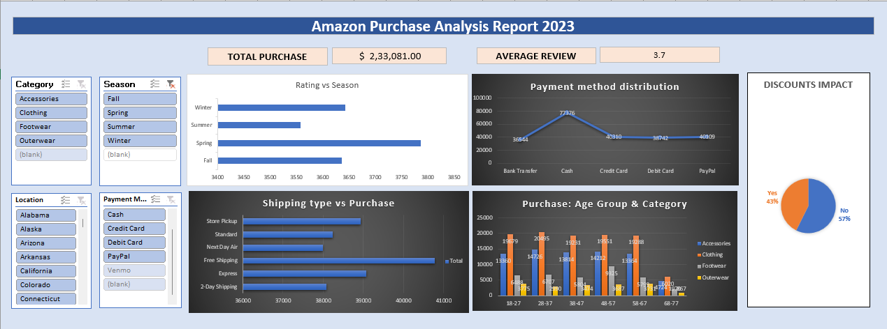

# 🛒 Amazon Purchase Analysis Dashboard (Excel)

## 📊 Overview
This project analyzes a **synthetic e-commerce dataset** to uncover customer behavior, product trends, and purchase patterns.  
It demonstrates **Excel skills** in data cleaning, visualization, and interactive dashboard creation — perfect for showcasing analytics capabilities to recruiters and collaborators.

## 📂 Dataset
- **Type:** Synthetic dataset (not real customer data).
- **Rows:** Expandable (currently ~3000 records).
- **Columns:**
  - Age, Gender, Item Purchased, Category, Purchase Amount (USD)
  - Location, Size, Color, Season
  - Review Rating, Subscription Status, Shipping Type
  - Discount Applied, Promo Code Used
  - Previous Purchases, Payment Method, Frequency of Purchases

## 🔎 Analysis Highlights
- **Customer Demographics:** Spending patterns by age group and gender.
- **Product Insights:** Top categories and items purchased.
- **Payment Behavior:** Distribution of payment methods (Credit Card, PayPal, Venmo, Cash).
- **Shipping Trends:** Average spend by shipping type.
- **Discount Impact:** Effect of discounts and promo codes on purchase amounts.

## 📈 Dashboard Features
- Interactive **PivotTables & PivotCharts**.
- **Slicers** for Category, Season, Location, Payment Method.
- **Conditional Formatting** to highlight:
  - High spenders (Purchase Amount > $80).
  - Low review ratings (< 3.0).
- Dynamic KPIs:
  - Total Sales
  - Average Review Rating

## 🚀 How to Use
1. Download the Excel file from this repository.
2. Open the **Dashboard sheet**.
3. Use slicers to filter by category, season, or location.
4. Explore interactive charts and KPIs.

## 🛠 Tools & Skills Demonstrated
- Microsoft Excel (PivotTables, PivotCharts, Slicers, Conditional Formatting,Data Validation,Advanced functions)
- Data Cleaning & Preparation
- Analytical Storytelling
- GitHub Documentation

